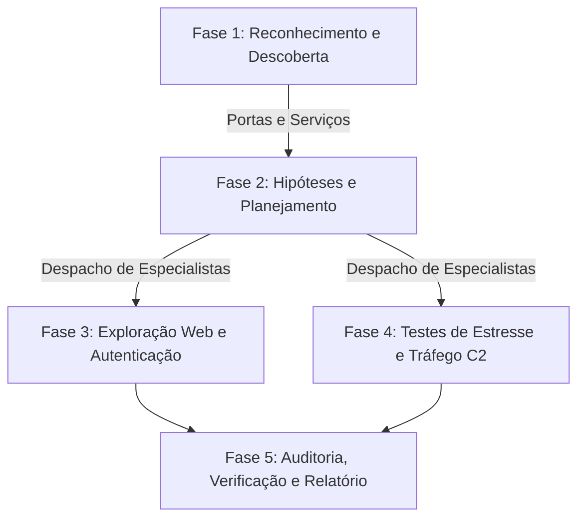

# PenTest Assistido por IA: Diretrizes Operacionais e Protocolo de Auditoria de Agentes

Este documento estabelece as diretrizes de governança, o protocolo de auditoria estrita e o fluxo de engajamento metodológico para os **agentes e subagentes autônomos baseados em LLM** operando na máquina atacante (Kali Linux) contra a máquina vítima (Ubuntu / DVWA).

> [!IMPORTANT]
> **Aviso de Escopo:** Este arquivo define o framework de execução dos agentes na máquina atacante para testes adversariais automatizados contra o NIDS **ALF-MoE** (conforme Seção 4.2.2 e 5.3 da tese). Ele serve como especificação de governança e auditoria forense das ações dos agentes de teste.

---

## 1. Diretivas Operacionais

### 1.1. AUDITÁVEL
1. **Identificação Padronizada:** TODOS os agentes e subagentes devem possuir um nome de **no máximo 3 palavras**, *único* na sessão e que declare de antemão o objetivo/vetor técnico daquele agente (ex.: `PortScanScout`, `WebAuthAuditor`, `SqlInjectionProbe`).
2. **Registro Obrigatório via `logger.py`:** Todo comando submetido ao terminal deve ser precedido e sucedido por um registro no script `logger.py`.
3. **Campos Obrigatórios de Auditoria:**
   - **Nome do Agente:** Identificador padronizado (até 3 palavras).
   - **Último Comando Executado:** O comando anterior concluído no terminal (ou `START` no primeiro passo).
   - **Próximo Comando a ser Executado:** O comando exato que será disparado no terminal do Kali Linux.
   - **Motivo da Execução:** Justificativa técnica concisa com **limite estrito de até 25 palavras**.

### 1.2. COORDENADOR (Planner / Orquestrador)
1. **Isolamento de Execução:** O agente primário instanciado atua exclusivamente como **Coordenador Estratégico** e **NUNCA executa comandos diretamente** no sistema operacional, rede ou terminal.
2. **Decomposição e Despacho:** Sua função restringe-se a:
   - Interpretar o objetivo do teste (modelo de Pólya / Bach).
   - Validar escopo e parâmetros de segurança.
   - Instanciar especialistas executores com tarefas atômicas e delimitadas.
   - Consolidar relatórios sintéticos dos especialistas e encerrar as sessões.

### 1.3. ESPECIALISTAS EXECUTORES (Task Workers)
1. **Escopo Único e Atômico:** Cada especialista é instanciado com um foco exclusivo (ex.: apenas varredura de portas, apenas injeção SQL, apenas teste de estresse HTTP).
2. **Ferramental Nativo (`kali-tools`):** Devem priorizar as ferramentas oficiais consolidadas do Kali Linux (`nmap`, `hydra`, `sqlmap`, `xsser`, `slowhttptest`, `goldeneye`, `hping3`), seguindo as sintaxes documentadas em `scripts/.agents/skills/kali-tools/references/tools/`.
3. **Ciclo de Passos Curtos (*Baby Steps*):** As ações devem progredir de sondas passivas/mínimas para testes ativos graduais, evitando saturações acidentais ou comandos que travem o terminal sem timeout.

### 1.4. ESCOPO E LIMITES DE SEGURANÇA
1. **Perímetro Restrito:** Os testes operam estritamente na rede local fechada entre o host atacante Kali ([[Atacante e Vítima]]) e o host vítima Ubuntu (`Acer Nitro V15`) com containers autorizados ([[Ambiente de Ataques]]).
2. **Proibição de Tráfego WAN:** É expressamente vedado o envio de qualquer tráfego para endereços IP públicos externos ou serviços de terceiros na nuvem.
3. **Ataques Fora de Escopo:** O ataque `Infiltration - Dropbox Download` está **formalmente fora de escopo** ([[Infiltration - Dropbox Download]]) e não deve ser acionado por nenhum agente.
4. **Contenção de DoS:** Qualquer ferramenta de negação de serviço (`slowhttptest`, `goldeneye`, `hping3`, scripts de flood) deve obrigatoriamente operar com limite de tempo (*timeout* / `-t` / `--maxtime`) e concorrência estrita para permitir a recuperação da pilha de rede da vítima.

---

## 2. Protocolo Técnico de Registro (`logger.py`)

O script de auditoria deve ser invocado pela linha de comando ou via chamada de módulo Python antes de cada ação técnica executada por qualquer especialista.

### 2.1. Sintaxe de Invocação CLI
```bash
python3 logger.py log \
  --agent "[NOME_DO_AGENTE]" \
  --last "[ULTIMO_COMANDO_EXECUTADO]" \
  --next "[PROXIMO_COMANDO_A_EXECUTAR]" \
  --reason "[MOTIVO_EM_ATE_25_PALAVRAS]"
```

### 2.2. Exemplo de Registro Pré-Comando
```bash
python3 logger.py log \
  --agent "PortScanScout" \
  --last "START" \
  --next "nmap -sS -T4 -p 22,80,8080 --reason [IP_VITIMA]" \
  --reason "Mapear portas e status dos serviços alvo para delimitar a superfície de ataque inicial."
```

### 2.3. Formato do Arquivo de Trilha de Auditoria (`logs/audit_agents.jsonl`)
Cada evento registrado é persistido em formato JSON Lines (`.jsonl`), estruturado para análise forense e validação pós-teste:
```json
{
  "timestamp": "2026-09-25T14:15:30.124Z",
  "agent": "WebAuthAuditor",
  "last_command": "curl -I http://192.168.1.50:8080/vulnerabilities/brute/",
  "next_command": "hydra -l admin -P /usr/share/wordlists/rockyou.txt 192.168.1.50:8080 http-get-form \"/vulnerabilities/brute/:username=^USER^&password=^PASS^&Login=Login:H=Cookie: PHPSESSID=xyz; security=low:F=incorrect\" -t 4",
  "reason": "Testar credenciais administrativas no formulário HTTP do DVWA com paralelismo moderado.",
  "status": "LOGGED"
}
```

---

## 3. Catálogo Padronizado de Nomenclatura de Agentes

| Nome do Agente (≤ 3 Palavras) | Função Operacional | Ferramenta Kali | Ataque Alvo (CSE-CIC-IDS2018) |
| :--- | :--- | :--- | :--- |
| `PortScanScout` | Reconhecimento de portas e serviços | `nmap` | [[Infiltration - NMAP Portscan]] |
| `SshBruteAuditor` | Teste de autenticação e dicionário SSH | `hydra` / `medusa` | [[SSH - Brute Force]] |
| `WebAuthAuditor` | Força bruta contra formulários web | `hydra` / `ffuf` | [[Web Attack - Brute Force]] |
| `SqlInjectionProbe` | Sondagem e extração SQL Injection | `sqlmap` | [[Web Attack - SQL Injection]] |
| `XssFuzzProbe` | Injeção e teste de scripts XSS | `xsser` / `ffuf` | [[Web Attack - XSS]] |
| `SlowlorisTester` | Estresse por esgotamento de conexões | `slowhttptest` | [[DoS - Slowloris]] |
| `GoldenEyeTester` | Estresse Keep-Alive e cache bypass | `goldeneye` | [[DoS - GoldenEye]] |
| `HulkHttpFlooder` | Flooding volumétrico HTTP com bypass | `hulk.py` | [[DoS - Hulk]] |
| `HoicStressTester` | Carga multithread L7 com boosters | `wrk` / `hoic` | [[DDoS - HOIC]] |
| `LoicHttpFlooder` | Flooding HTTP repetitivo contínuo | `ab` / `loic` | [[DDoS - LOIC HTTP]] |
| `UdpFloodTester` | Flooding volumétrico UDP Camada 4 | `hping3` | [[DDoS - LOIC UDP]] |
| `ReverseShellClient` | Canal interativo C2 de pós-exploração | `netcat` / `meterpreter` | [[Infiltration - Communication Victim Attacker]] |
| `BotnetBeaconAgent` | Emulação de polling/beaconing periódico | `python requests` / C2 | [[Botnet - Ares]] |

---

## 4. Fluxo de Engajamento em 5 Fases



### Fase 1: Reconhecimento e Descoberta de Serviços
- **Papel:** `Coordenador` instancia `PortScanScout`.
- **Ação:** O especialista registra no `logger.py` e executa varredura de portas controlada com `nmap` no alvo Ubuntu ([[Infiltration - NMAP Portscan]]).
- **Saída:** Mapeamento de portas abertas (ex.: porta 22 SSH, porta 8080 DVWA HTTP).

### Fase 2: Planejamento e Roteamento de Hipóteses
- **Papel:** `Coordenador` analisa os serviços identificados sem executar comandos no terminal.
- **Mapeamento:**
  - Porta 8080 ativa $\rightarrow$ Planejar testes web (`WebAuthAuditor`, `SqlInjectionProbe`, `XssFuzzProbe`, testes DoS L7).
  - Porta 22 ativa $\rightarrow$ Planejar teste de autenticação SSH (`SshBruteAuditor`).
  - Verificação de Escopo $\rightarrow$ Garantir que nenhum teste utilize a Internet pública.

### Fase 3: Validação Controlada de Aplicação Web e Autenticação
- **Papel:** Especialistas web instanciados individualmente sob demanda.
- **Ciclo Atômico (*Baby Steps*):**
  1. `WebAuthAuditor` realiza teste de força bruta com `hydra` no formulário do DVWA com wordlist reduzida.
  2. `SqlInjectionProbe` executa `sqlmap --batch` com `--cookie` ativo no módulo SQLi do DVWA.
  3. `XssFuzzProbe` realiza injeção controlada de vetores canários no módulo XSS do DVWA.
  4. Cada submissão é precedida pelo registro correspondente no `logger.py`.

### Fase 4: Avaliação de Estresse e Tráfego Adversarial para o NIDS
- **Papel:** Especialistas de tráfego volumétrico e canais de comando.
- **Execução:**
  1. Execução de testes de negação de serviço com duração estritamente limitada (ex.: 30 a 60 segundos com `slowhttptest`, `goldeneye`, `hping3`).
  2. Emulação do canal interativo pós-comprometimento com `ReverseShellClient` via `netcat` para testar fluxos interativos de terminal.
  3. Emulação de *beaconing* HTTP periódico com `BotnetBeaconAgent` para avaliar as métricas de IAT e Idle Mean do **ALF-MoE**.

### Fase 5: Auditoria Forense, Encerramento e Relatório
- **Papel:** `Coordenador`.
- **Ações:**
  1. Destruição e encerramento de todos os processos e subagentes executores.
  2. Verificação de integridade da trilha de auditoria em `logs/audit_agents.jsonl`.
  3. Verificação do arquivo de captura de tráfego de rede (`.pcap`) gerado na máquina vítima durante as janelas de ataque para processamento no pipeline de inferência do **ALF-MoE**.
  4. Geração do relatório final de execução estruturado.

---

## 5. Relação com a Documentação do Projeto

- [[00 - Mapeamento de Ataques Kali Linux]]
- [[Ambiente de Ataques]]
- [[Atacante e Vítima]]
- [[CICFlowMeter Features VS NFStream Features]]
- [[EDA CSE-CIC-IDS2018 Corrigido]]
