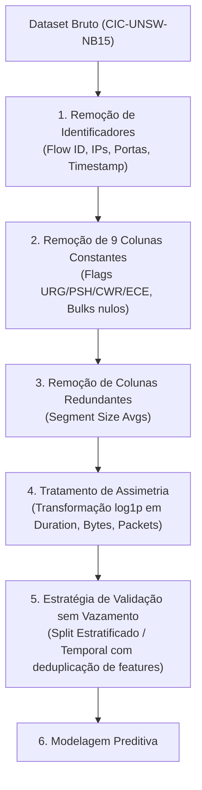

# Relatório Técnico de Análise Exploratória de Dados (EDA)
## Datasets: `CIC-UNSW-NB15.csv` e `CIC-UNSW-NB15_sampled.csv`

---

### Sumário Executivo e Metadados da Análise

- **Data da Análise:** 29 de Setembro de 2026
- **Status Metodológico:** Análise Exploratória e Diagnóstica (Geradora de Hipóteses). Sem inferência causal confirmatória.
- **Ambiente de Execução:** Python 3.11.9 (`~/.venv`), Pandas 3.0.3, NumPy 2.4.6, SciPy 1.17.1, Matplotlib 3.11.1, Seaborn 0.13.2.
- **Integridade dos Dados Originais:** Acesso estritamente somente-leitura aos arquivos brutos. Nenhum registro foi modificado, imputado ou deletado na origem.

```
+------------------------------------+--------------------------+------------------------------+
| Métrica                            | CIC-UNSW-NB15.csv        | CIC-UNSW-NB15_sampled.csv    |
+------------------------------------+--------------------------+------------------------------+
| Tamanho em Disco                   | 1.8 GB (1,932,735,263 B) | 76.0 MB (79,642,881 B)       |
| Total de Registros (Linhas)        | 3,540,241 fluxos         | 139,583 fluxos               |
| Total de Colunas                   | 84 atributos             | 84 atributos                 |
| Valores Nulos / Ausentes (NaN)     | 0 (0.00%)                | 0 (0.00%)                    |
| Valores Infinitos (Inf / -Inf)     | 0 (0.00%)                | 0 (0.00%)                    |
| Valores Numéricos Negativos        | 0 (0.00%)                | 0 (0.00%)                    |
| Proporção Benign                   | 97.47% (3,450,658)       | 35.82% (50,000)              |
| Proporção Ataques (9 classes)      | 2.53% (89,583)           | 64.18% (89,583)              |
| Taxa de Preservação dos Ataques    | 100.0% (Referência)      | 100.0% (Exatamente idênticos)|
+------------------------------------+--------------------------+------------------------------+
```

---

## 1. O Mecanismo de Amostragem e Comparação Estrutural

A análise comparativa revelou o método exato utilizado na concepção da versão amostrada:

> [!IMPORTANT]
> **Estratégia de Amostragem Identificada:**
> A amostra `CIC-UNSW-NB15_sampled.csv` **não** foi gerada por amostragem aleatória uniforme global. Tratou-se de uma **subamostragem dirigida da classe majoritária (`Benign`)**, fixada em exatamente **50.000 instâncias**, enquanto **100% de todas as 89.583 instâncias de ataque** (distribuídas nas 9 famílias maliciosas) foram rigorosamente preservadas do dataset original.


### Tabela Detalhada de Classes: Completo vs. Amostrado

| Classe | Completo (Contagem) | Completo (%) | Amostrado (Contagem) | Amostrado (%) | Taxa de Retenção |
| :--- | :--- | :--- | :--- | :--- | :--- |
| **Benign** | 3,450,658 | 97.470% | 50,000 | 35.821% | 1.45% (Subamostrado) |
| **Exploits** | 30,951 | 0.874% | 30,951 | 22.174% | **100.0% (Total)** |
| **Fuzzers** | 29,613 | 0.836% | 29,613 | 21.215% | **100.0% (Total)** |
| **Reconnaissance** | 16,735 | 0.473% | 16,735 | 11.989% | **100.0% (Total)** |
| **Generic** | 4,632 | 0.131% | 4,632 | 3.318% | **100.0% (Total)** |
| **DoS** | 4,467 | 0.126% | 4,467 | 3.200% | **100.0% (Total)** |
| **Shellcode** | 2,102 | 0.059% | 2,102 | 1.506% | **100.0% (Total)** |
| **Backdoor** | 452 | 0.013% | 452 | 0.324% | **100.0% (Total)** |
| **Analysis** | 385 | 0.011% | 385 | 0.276% | **100.0% (Total)** |
| **Worms** | 246 | 0.007% | 246 | 0.176% | **100.0% (Total)** |
| **TOTAL** | **3,540,241** | **100.0%** | **139,583** | **100.0%** | **3.94%** |

### Auditoria de Representatividade da Classe Benign (Teste Kolmogorov-Smirnov)

Como todos os ataques são idênticos em ambos os conjuntos, qualquer divergência nas distribuições condicionais decorre exclusivamente do filtro aplicado sobre a classe `Benign`.

O teste bi-amostral de Kolmogorov-Smirnov (KS-test) comparando 103.521 fluxos benignos do conjunto completo contra os 50.000 fluxos benignos da amostra revelou que **a amostragem introduziu um viés estatístico significativo em fluxos curtos**:

1. **Duração do Fluxo (`Flow Duration`):** Mediana de 20.681 µs na amostra versus 1.114 µs no completo ($KS = 0.208, p < 10^{-15}$).
2. **Proporção de Fluxos de Pacote Único (`Total Fwd Packet == 1`):** Representa **40.71%** no conjunto completo, mas apenas **25.97%** na amostra.
3. **Taxa de Pacotes (`Bwd Packets/s` e `Fwd Packets/s`):** Divergência acentuada ($KS > 0.21$), pois fluxos de curtíssima duração do tráfego real foram descartados em taxa desproporcional.


---

## 2. Auditoria de Vazamento de Dados (*Data Leakage*) e Identificadores

Conforme diretriz do usuário, os atributos identificadores (`Flow ID`, `Src IP`, `Src Port`, `Dst IP`, `Dst Port`, `Timestamp`) devem ser descartados antes do treinamento preditivo. A análise empírica demonstra o perigo crítico caso não fossem:

### A. Risco Crítico de *Shortcut Learning* (Vazamento por IPs)

- **100.0% de todos os 89.583 ataques** originam-se exclusivamente de quatro endereços IP do testbed:
  - `175.45.176.0` (22.939 ataques)
  - `175.45.176.1` (22.927 ataques)
  - `175.45.176.3` (22.461 ataques)
  - `175.45.176.2` (21.256 ataques)
- O tráfego benigno provém da rede sintética simulada `59.166.0.0/24` (com destino a servidores `149.171.126.X`).
- Qualquer modelo com acesso a `Src IP` ou `Flow ID` atinge acurácia artificial de 100% decorando a sub-rede `175.45.176.X`, tornando-se inútil para detecção em redes reais.

### B. Auditoria de Duplicatas e Conflito de Rótulos

A auditoria de integridade com hashing de registros 64-bit revelou padrões essenciais de redundância de fluxos de rede:


1. **Duplicatas Exatas (Todas as Colunas):**
   - No dataset completo: **59.906 registros (1.69%)** são cópias idênticas inclusive de IP, porta e timestamp exato (retransmissões ou artefatos de captura).
   - No amostrado: **0 duplicatas exatas**.
2. **Duplicatas Estruturais de Tráfego (Excluindo Identificadores):**
   - No dataset completo: **1.635.117 registros (46.19%)** possuem exatamente as mesmas características estatísticas de tráfego. Isso ocorre devido a padrões repetitivos de rede (consultas DNS padrão, handshakes TCP vazios, keep-alives).
   - No amostrado: **13.169 registros (9.43%)** são duplicatas consistentes.
3. **Conflito Semântico de Rótulos (Mesmas Features, Rótulos Opostos):**
   - No dataset completo: **1.123 registros** têm vetores de atributos estatísticos exatamente idênticos, mas rótulos diferentes (e.g., um marcado como `Benign` e outro como `Exploits` ou `Reconnaissance`).
   - No amostrado: **558 registros conflitantes**.
   - **Impacto:** Estabelece um teto de Bayes inelutável para classificadores que operem estritamente sobre essas variáveis.

---

## 3. Estrutura de Variáveis, Redundância e Multicolinearidade

O extrator CICFlowMeter produz 77 variáveis contínuas e discretas além dos 6 identificadores e do alvo `Label`.

### A. Colunas Constantes (Variância Zero)

Exatamente as mesmas **9 colunas são estritamente constantes (valor 0 para 100% dos fluxos)** em ambos os datasets:
1. `Bwd PSH Flags` (todas 0)
2. `Fwd URG Flags` (todas 0)
3. `Bwd URG Flags` (todas 0)
4. `URG Flag Count` (todas 0)
5. `CWR Flag Count` (todas 0)
6. `ECE Flag Count` (todas 0)
7. `Fwd Bytes/Bulk Avg` (todas 0)
8. `Fwd Packet/Bulk Avg` (todas 0)
9. `Fwd Bulk Rate Avg` (todas 0)

> [!NOTE]
> Essas 9 colunas não fornecem nenhuma informação estatística ou poder discriminatório e devem ser eliminadas imediatamente no pipeline de pré-processamento.

### B. Aliases Redundantes e Multicolinearidade Extrema ($|r| > 0.95$)

- **Duplas Idênticas ($r = 1.0000$ e erro relativo zero):**
  - `Fwd Packet Length Mean` $\equiv$ `Fwd Segment Size Avg`
  - `Bwd Packet Length Mean` $\equiv$ `Bwd Segment Size Avg`
- **Correlações Quase Perfeitas:**
  - `Flow Packets/s` $\leftrightarrow$ `Fwd Packets/s` ($r = 0.9999$)
  - `Flow Duration` $\leftrightarrow$ `Fwd IAT Total` ($r = 0.9985$)
  - `Idle Mean` $\leftrightarrow$ `Idle Min` ($r = 0.9979$)
  - `Total Length of Fwd Packet` $\leftrightarrow$ `Fwd Act Data Pkts` ($r = 0.9958$)
  - `Flow IAT Max` $\leftrightarrow$ `Idle Max` ($r = 0.9954$)
  - `Bwd Bytes/Bulk Avg` $\leftrightarrow$ `Bwd Packet/Bulk Avg` ($r = 0.9946$)
  - `Total Fwd Packet` $\leftrightarrow$ `Fwd Header Length` ($r = 0.9937$)


---

## 4. Sensibilidade de Distribuições, Assimetria e Valores Extremos (*Outliers*)

Seguindo as normas de EDA (NIST Handbook e scikit-learn guidelines), analisamos a influência de caudas pesadas comparando medidas clássicas (Média / Desvio Padrão) com medidas robustas (Mediana / IQR / MAD):

### A. Divergência Crítica entre Média e Mediana

As variáveis de tráfego de rede exibem assimetria positiva severa e caudas hiper-alongadas (distribuições de Pareto / cauda pesada):

| Variável | Média Amostrada | Mediana | IQR | MAD | Assimetria Bruta | Assimetria $\log(1+x)$ |
| :--- | :--- | :--- | :--- | :--- | :--- | :--- |
| **Flow Duration** | 1,732,328 µs | 179,305 µs | 722,860 µs | 179,305 µs | +7.21 | -0.18 |
| **Flow Bytes/s** | 7,214,566 B/s | 2,218.7 B/s | 83,555.4 B/s | 2,218.7 B/s | +28.94 | +0.42 |
| **Total Length of Fwd Packet** | 12,946.6 B | 248.0 B | 884.0 B | 216.0 B | **+50.43** | **-0.10** |
| **Total Fwd Packet** | 25.5 pkts | 6.0 pkts | 6.0 pkts | 3.0 pkts | **+46.81** | **+1.19** |
| **Bwd IAT Min** | 9.59 µs | 2.0 µs | 1.0 µs | 1.0 µs | **+166.87** | **+0.17** |

> [!TIP]
> A transformação logarítmica ($\log_{10}$ ou $\log(1+x)$) reduz drasticamente a assimetria (e.g., de $+50.43$ para $-0.10$ em `Total Length of Fwd Packet`), sendo recomendada para estabilizar gradientes e modelos baseados em distância (KNN, SVM, Redes Neurais).

### B. Inflação de Zeros (*Zero-Inflation*)

- **Timers Ativos e Inativos:** `Active Mean`, `Active Std`, `Active Max`, `Active Min`, `Idle Mean`, `Idle Std`, `Idle Max`, `Idle Min` apresentam **98.8% a 99.6% de valores zero**, pois a imensa maioria dos fluxos encerra-se antes de atingir os tempos limites de inatividade.
- **Métricas de Subfluxo:** `Subflow Fwd/Bwd Packets/Bytes` possuem **> 95.6% de zeros**.
- **Flag RST:** $99.96\%$ de zeros.

### C. Proporção de Valores Fora das Fences de Tukey ($1.5 \times IQR$)

Em modelos estatísticos convencionais, valores além de $Q_3 + 1.5 \times IQR$ são denominados *outliers*. Contudo, em redes de computadores, taxas de até **$30.7\%$ de instâncias acima das fences** (e.g. `Bwd Init Win Bytes`, `PSH Flag Count`, `Flow Bytes/s`) **não representam erros de medição ou dados corrompidos**, mas sim transferências volumosas legítimas (downloads HTTP, backups) ou ataques volumétricos (DoS floods). **Não devem ser deletados.**

---

## 5. Perfil Comportamental das Classes de Ataque

As classes de tráfego exibem assinaturas volumétricas e temporais bastante distintas:


1. **Reconnaissance & Shellcode:**
   - Taxas de pacotes por segundo extremamente altas (médias de $120.031$ e $142.554$ pkts/s).
   - Fluxos unilaterais: mediana de `Total Bwd packets` e `Total Length of Bwd Packet` é **0.0** (varreduras de portas ou conexões abortadas sem payload de retorno).
2. **DoS (Denial of Service):**
   - Alto volume de pacotes e bytes bidirecionais: médias de 67 pacotes Fwd e 68 pacotes Bwd; tamanho médio de pacote de 229 bytes; média de 132 flags ACK.
3. **Exploits & Generic:**
   - Duração média moderada a longa ($591$ ms a $11.3$ s); payloads maiores com medianas de 376 a 902 bytes enviados e 726 a 382 bytes recebidos.
4. **Fuzzers:**
   - Alta variabilidade de `Flow Bytes/s` ($19.7 \times 10^6$ B/s em média) e duração intermediária (mediana de 151 ms).

---

## 6. Artefatos Sintéticos do Ambiente de Laboratório (*Testbed Fingerprints*)

Uma das descobertas mais marcantes da análise exploratória diz respeito aos atributos `FWD Init Win Bytes` e `Bwd Init Win Bytes` (Tamanho Inicial da Janela TCP):


- **Comportamento nos Ataques:**
  Em todas as 9 famílias de ataque, a mediana de `FWD Init Win Bytes` e `Bwd Init Win Bytes` é exatamente **16.383** (valor hexadecimal `0x3FFF`). Em classes como `Exploits`, `Fuzzers`, `Analysis` e `Worms`, mais de **90% a 100% dos fluxos fixam a janela em 16.383**.
  Esse valor corresponde à configuração de socket padrão do gerador de tráfego sintético utilizado no testbed do UNSW-NB15 (IXIA PerfectStorm / ferramentas de ataque automatizadas).
- **Comportamento em Benign:**
  A classe benigna apresenta valores heterogêneos típicos de pilhas TCP de sistemas operacionais diversos (mediana Fwd de 5.792 bytes e Bwd de 14.480 bytes, correspondentes a janelas padrão Linux/Windows).
- **Alerta Metodológico:** Um classificador de Machine Learning pode explorar essa variável como um substituto do IP para separar ataques e benignos sem aprender os padrões comportamentais reais da invasão.

---

## 7. Diretrizes Práticas para Engenharia de Features e Modelagem

Com base nas evidências empíricas levantadas, sintetizam-se as seguintes recomendações:



1. **Descarte de Identificadores:** Eliminar obrigatoriamente `Flow ID`, `Src IP`, `Src Port`, `Dst IP`, `Dst Port`, `Timestamp`.
2. **Remoção de Colunas de Variância Zero:** Descartar as 9 colunas estritamente nulas (`Bwd PSH Flags`, `Fwd URG Flags`, `Bwd URG Flags`, `URG Flag Count`, `CWR Flag Count`, `ECE Flag Count`, `Fwd Bytes/Bulk Avg`, `Fwd Packet/Bulk Avg`, `Fwd Bulk Rate Avg`).
3. **Desduplicação de Aliases:** Descartar `Fwd Segment Size Avg` e `Bwd Segment Size Avg` (redundância idêntica a `Fwd Packet Length Mean` e `Bwd Packet Length Mean`).
4. **Resolução de Multicolinearidade:** Entre `Flow Packets/s` e `Fwd Packets/s` ($r = 0.9999$), manter apenas um; similarmente entre `Flow Duration` e `Fwd IAT Total` ($r = 0.9985$).
5. **Cuidado com Janela TCP (`FWD/Bwd Init Win Bytes`):** Avaliar testes de robustez *out-of-distribution* removendo ou perturbando essa variável para evitar dependência do artefato `16383`.
6. **Estratégia de Validação:**
   - Não utilizar K-Fold puramente aleatório sem tratar as **13.169 duplicatas estruturais** na amostra, sob pena de vazamento entre treino e teste.
   - Tratar os **558 fluxos com rótulos ambíguos**.
7. **Ponderação de Classes:** Lembrar que a amostra possui proporção de 35.8% Benign / 64.2% Ataques, enquanto a realidade da rede (dataset completo) possui 97.5% Benign. Métricas como Acurácia serão ilusórias; deve-se focar em **F1-Macro, Precision-Recall AUC (PR-AUC) e Matriz de Confusão com custos assimétricos**.

---
*Relatório exportado diretamente para o workspace em formato Markdown independente e autocontido.*
